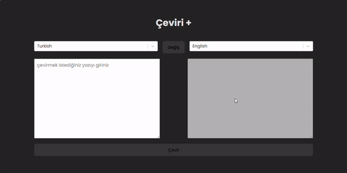

# Translation App

A translation application offering support for a total of 110 distinct languages

## Used Libraries and Tools

- [Redux Toolkit](https://redux-toolkit.js.org/): Used for state management.
- [Axios](https://axios-http.com/): Employed for making HTTP requests.
- [React](https://reactjs.org/): Primarily used for building the user interface.
- [React-Redux](https://react-redux.js.org/): Utilized to connect Redux with the React application.
- [React-Select](https://react-select.com/): Used as an advanced selection component with rich options.
- [SASS](https://sass-lang.com/): Utilized for styling and design.

### Screen

